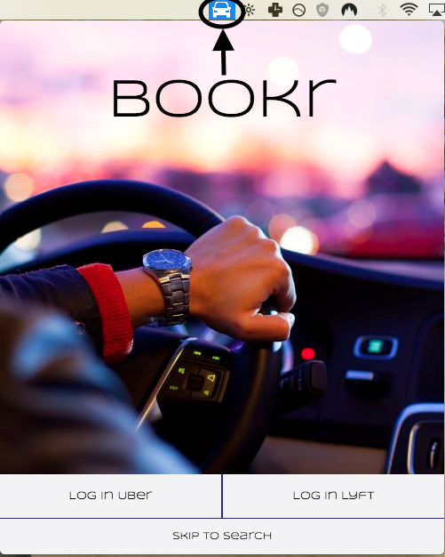
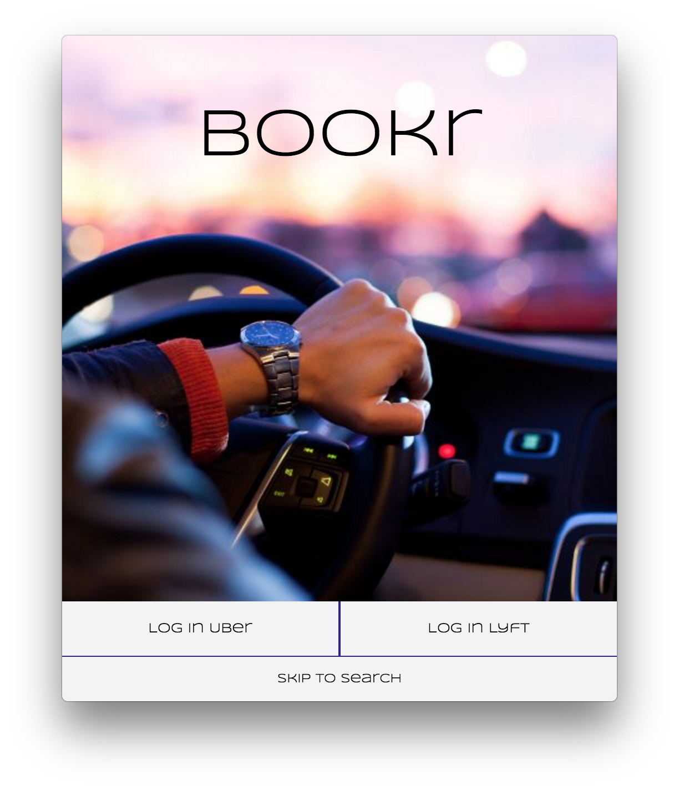
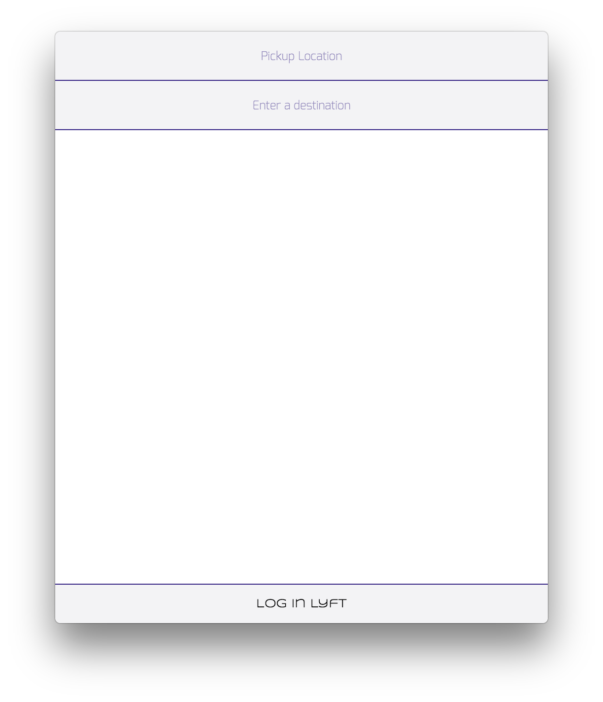
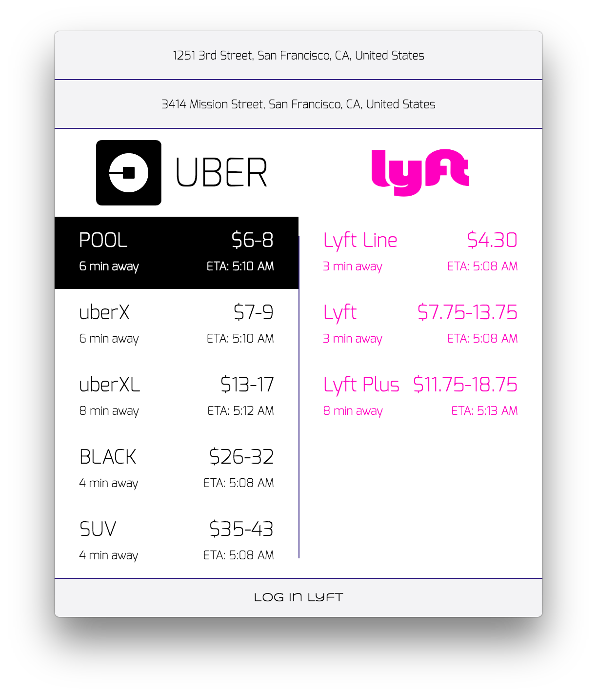
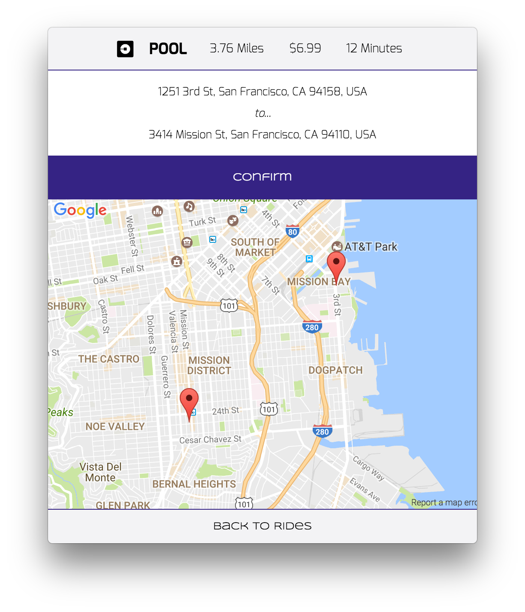
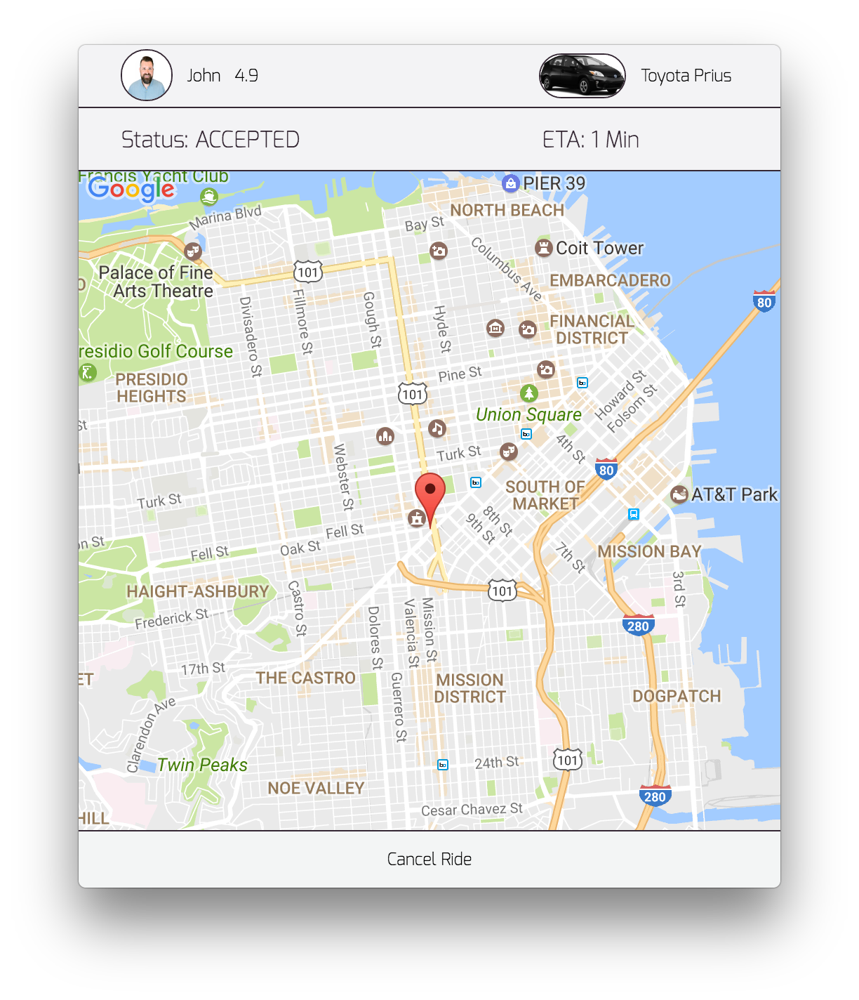

# Bookr

[Demo page][demo]

## Summary

Bookr is a desktop application written in Electron for comparing and booking Uber and Lyft rides. It allows the user to view equivalent ride services side by side and choose the option that they prefer to book. Bookr was written in React.js with a Node.js server using Express to connect to Uber and Lyft's API's.

## Installation

Download the app [here.][demo] Once it has downloaded, unpack the dmg and run the file. A car icon should appear in the menubar.

Here is what the menubar icon looks like.


## Screenshots

Login Page


Quotes Page Start


Quotes Results


Confirm Page


Enroute Page


## Technologies

Bookr uses:
- [Electron][electron]
- [React.js][react]
- [Redux][redux]
- [Express.js][express]
- [Uber API][uber]
- [Lyft API][lyft]
- [Google Maps][google]
- [client-oauth2][oauth]

## Implementation

Uber and Lyft's API's both require OAuth2 authentication to use their booking features. This is a multi-step process that required a local server to complete. We used Node.js with Express in order to get an access_token that we could use to book rides.

```javascript
app.use('/app', express.static(path.join(__dirname, './app')));

app.get('/uber', (req, res) => {
  let uri = uberAuth.code.getUri();
  res.redirect(uri);
});

app.get('/uberCallback', (req, res) => {
  let uberUserInfo;

  uberAuth.code.getToken(req.originalUrl)
    .then(user => {
      user.refresh();

      user.sign({
        method: 'get',
        url: 'http://localhost:5000'
      });

      uberUserInfo = qs.stringify({
        access_token: user.data.access_token,
        refresh_token: user.data.refresh_token,
        token_type: user.data.token_type,
        scope: user.data.scope,
        expires_in: user.data.expires_in,
        expires: user.expires
      });
      return;
    })
    .then(() => {
      return res.redirect('/#/uberAuth/' + uberUserInfo);
    })
    .catch(() => {
      return res.redirect('/#/');
    });
});
```

This code handles updating the state when the Google Maps Autocomplete changes. If the address changes, we also update the corresponding geolocation. If we have a pickup and destination geolocation and there is a change in some of the geolocations, we make a series of calls to the Uber and Lyft APIs to get their updated fare and pickup time estimates.

```javascript
componentWillReceiveProps(newProps) {
  if (this.props.quotes.address.current === ""){
    this.props.getCurrentGeolocation(newProps.quotes.address.current);
  } else {
    const newGeos = newProps.quotes.geolocations;
    const oldGeos = this.props.quotes.geolocations;

    if (newGeos.current !== "" && newGeos.destination !== "" &&
      (newGeos.current.lat !== oldGeos.current.lat ||
        newGeos.current.lng !== oldGeos.current.lng ||
        newGeos.destination.lat !== oldGeos.destination.lat ||
        newGeos.destination.lng !== oldGeos.destination.lng)) {
      this.props.clearQuotesAndTimes();
      this.props.getLyftQuotes(newGeos.current.lat, newGeos.current.lng,
        newGeos.destination.lat, newGeos.destination.lng);
      this.props.getUberQuotes(newGeos.current.lat, newGeos.current.lng,
        newGeos.destination.lat, newGeos.destination.lng);
      this.props.getLyftETAs(newGeos.current.lat, newGeos.current.lng);
      this.props.getUberETAs(newGeos.current.lat, newGeos.current.lng);
    }
  }
}
```

In order to simulate the process of real-time driver updates from the API, sandbox queries were required to be set up to perform tests. Difficulties arising from Cross-Origin Resource Sharing (CORS) necessitated having to use #stringify on the data being sent.

```javascript
$.ajax({
  method: 'POST',
  url: `https://sandbox-api.uber.com/v1.2/requests`,
  headers: {
    Authorization: "Bearer " + UBER_TOKEN,
    'Content-Type': "application/json"
  },
  processData: false,
  data: JSON.stringify({
    "fare_id": "5f3d2dafbe9effbec37dc41cf62ae0dff4a5c977aa25734521691077c036277e",
    "product_id": "a1111c8c-c720-46c3-8534-2fcdd730040d",
    "start_latitude": 37.7752278,
    "start_longitude": -122.4197513,
    "end_latitude": 37.7773228,
    "end_longitude": -122.4272052})
  })
);

export const sandboxAcceptedRide = () => (
  $.ajax({
    method: 'PUT',
    url: `https://sandbox-api.uber.com/v1.2/sandbox/requests/fb5c28d0-3343-46b1-a6d6-bbff79f52aa4`,
    headers: {
      Authorization: "Bearer " + UBER_TOKEN,
      'Content-Type': "application/json"
    },
    processData: false,
    data: JSON.stringify({
      'status': "accepted"
    })
  })
);

export const sandboxArrivedRide = () => (
  $.ajax({
    method: 'PUT',
    url: `https://sandbox-api.uber.com/v1.2/sandbox/requests/fb5c28d0-3343-46b1-a6d6-bbff79f52aa4`,
    headers: {
      Authorization: "Bearer " + UBER_TOKEN,
      'Content-Type': "application/json"
    },
    processData: false,
    data: JSON.stringify({
      'status': "arriving"
    })
  })
);
```


## To-do
- Add webhooks to enroute component
- Deal with surge confirmation in primetime
- Get Uber approval for all users to user app
- Integrate Postmates API for food delivery

[demo]: https://vinitp94.github.io/BookrLive/
[electron]: https://github.com/electron/electron
[react]: https://facebook.github.io/react/
[redux]: https://github.com/reactjs/redux
[express]: https://github.com/expressjs/express
[google]: https://developers.google.com/maps/
[uber]: https://developer.uber.com/
[lyft]: developer.lyft.com
[oauth]: https://www.npmjs.com/package/client-oauth2
