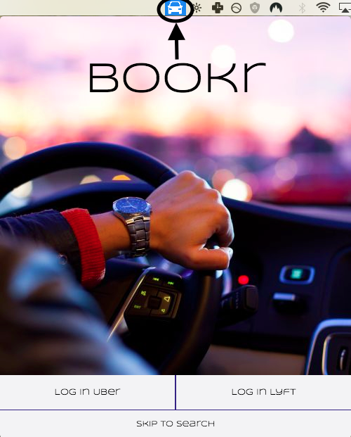

# Bookr

[Bookr][demo] is a desktop application written using Electron.js, allowing users to compare and book Uber and Lyft rides. Users are able to view all ride services side by side and choose the option that they prefer to book based on the presented ETA and projected costs of each. Bookr use React.js in conjunction with Redux for efficient rendering along with an Express.js server to communicated with the Uber and Lyft APIs.

## Installation

To just briefly view the app and its functionality without having to download it, check out the demo site [here][demo]. The app can also be downloaded from the same link by following these directions:

- Download using the provided link on the page
- Unpack the dmg and run the executable
- Shortly, an icon of a car should appear in the top menubar for macs
- Click to open page and use



## Architecture & Technologies

Bookr is built using:
- [Electron][electron]
- [React.js][react]/[Redux][redux]
- [Express.js][express]
- [Uber API][uber]
- [Lyft API][lyft]
- [Google Maps API][google]

The app does not have a true backend because no data really needs to be persisted. Express is integrated because a server is required in order for the Uber and Lyft APIs to communicate back with the user. The information is taken from the Express routes and passed to React for rendering. This is in theory, a single-page app as React renders all it's content within the single [root html file][./index.html].

Babel is used to transpile the jsx files to HTML. Because both Uber and Lyft use OAuth 2.0 to authenticate the app for users, a [webview][./webview.html] tag is used to host the guest content. All the static assets are stored in the [app folder][./app].

## Highlights

As mentioned, the Uber and Lyft APIs both utilize OAuth 2.0 to allow the developer to gather information on behalf of users. The APIs need a server to communicate with, so Express.js was used to build a bare-bones server as shown below:

  ```javascript
  app.use('/app', express.static(path.join(__dirname, './app')));

  app.get('/uber', (req, res) => {
    let uri = uberAuth.code.getUri();
    res.redirect(uri);
  });

  app.get('/uberCallback', (req, res) => {
    let uberUserInfo;

    uberAuth.code.getToken(req.originalUrl)
      .then(user => {
        user.refresh();

        user.sign({
          method: 'get',
          url: 'http://localhost:5000'
        });

        uberUserInfo = qs.stringify({
          access_token: user.data.access_token,
          refresh_token: user.data.refresh_token,
          token_type: user.data.token_type,
          scope: user.data.scope,
          expires_in: user.data.expires_in,
          expires: user.expires
        });
        return;
      })
      .then(() => {
        return res.redirect('/#/uberAuth/' + uberUserInfo);
      })
      .catch(() => {
        return res.redirect('/#/');
      });
  });
  ```

In addition the Uber and Lyft APIs, Google Maps was integrated to provide and enjoyable and intuitive UX. The following code updates the frontend state as the Google autocomplete changes. As the address changes, the geolocation is changed accordingly to update the fares that are presented. Behind the scenes, a simple change of address in either the origin or destination triggers a series of updates, eventually leading to the user viewing the updated fares for the given locations.

  ```javascript
  componentWillReceiveProps(newProps) {
    if (this.props.quotes.address.current === ""){
      this.props.getCurrentGeolocation(newProps.quotes.address.current);
    } else {
      const newGeos = newProps.quotes.geolocations;
      const oldGeos = this.props.quotes.geolocations;

      if (newGeos.current !== "" && newGeos.destination !== "" &&
        (newGeos.current.lat !== oldGeos.current.lat ||
          newGeos.current.lng !== oldGeos.current.lng ||
          newGeos.destination.lat !== oldGeos.destination.lat ||
          newGeos.destination.lng !== oldGeos.destination.lng)) {
        this.props.clearQuotesAndTimes();
        this.props.getLyftQuotes(newGeos.current.lat, newGeos.current.lng,
          newGeos.destination.lat, newGeos.destination.lng);
        this.props.getUberQuotes(newGeos.current.lat, newGeos.current.lng,
          newGeos.destination.lat, newGeos.destination.lng);
        this.props.getLyftETAs(newGeos.current.lat, newGeos.current.lng);
        this.props.getUberETAs(newGeos.current.lat, newGeos.current.lng);
      }
    }
  }
  ```


All apps have to be tested, but making real requests to the APIs would result in using personal funds to pay for cancellation fees. To avoid this, sandbox API calls were setup for testing in order to simulate real requests. The requests worked fine using Curl in the terminal, but CORS issues arose when making AJAX calls to the same API endpoints. Adding JSON.stringify removed these errors allowing for successful API calls.

  ```javascript
  export const sandboxRequestRide = () => (
    $.ajax({
      method: 'POST',
      url: `https://sandbox-api.uber.com/v1.2/requests`,
      headers: {
        Authorization: "Bearer " + UBER_TOKEN,
        'Content-Type': "application/json"
      },
      processData: false,
      data: JSON.stringify({
        "fare_id": "5f3d2dafbe9effbec37dc41cf62ae0dff4a5c977aa25734521691077c036277e",
        "product_id": "a1111c8c-c720-46c3-8534-2fcdd730040d",
        "start_latitude": 37.7752278,
        "start_longitude": -122.4197513,
        "end_latitude": 37.7773228,
        "end_longitude": -122.4272052})
      })
    );  
  )

  export const sandboxAcceptedRide = () => (
    $.ajax({
      method: 'PUT',
      url: `https://sandbox-api.uber.com/v1.2/sandbox/requests/fb5c28d0-3343-46b1-a6d6-bbff79f52aa4`,
      headers: {
        Authorization: "Bearer " + UBER_TOKEN,
        'Content-Type': "application/json"
      },
      processData: false,
      data: JSON.stringify({
        'status': "accepted"
      })
    })
  );

  export const sandboxArrivedRide = () => (
    $.ajax({
      method: 'PUT',
      url: `https://sandbox-api.uber.com/v1.2/sandbox/requests/fb5c28d0-3343-46b1-a6d6-bbff79f52aa4`,
      headers: {
        Authorization: "Bearer " + UBER_TOKEN,
        'Content-Type': "application/json"
      },
      processData: false,
      data: JSON.stringify({
        'status': "arriving"
      })
    })
  );
  ```

As can be seen from the above screenshot, the fares are presented side by side. These fares are presented as buttons that can be clicked to book rides. Users may accidentally click a button without meaning to, so to handle this, a confirm page was integrated. This page summarizes the ride information, prompting the user to confirm before a request is actually sent.


Upon clicking confirm, users are redirected to an enroute page that updates the status of the driver. The user is also able to cancel their ride from this page.


## Future Improvements

Bookr is an app that we put a great amount of effort into and we hope to continue to improve it.

#### Surge Confirmation

- Present surge confirmation to users before the confirm
- Show projected multiplied prices depending on surges

#### Webhooks

- Add webhooks to allow Uber and Lyft APIs to give the user ride updates

#### OAuth Refresh

- Refresh user access tokens for APIs so they don't have to log in again
- Revoke user access tokens upon logout

[demo]: https://vinitp94.github.io/BookrLive/
[electron]: https://github.com/electron/electron
[react]: https://facebook.github.io/react/
[redux]: https://github.com/reactjs/redux
[express]: https://github.com/expressjs/express
[google]: https://developers.google.com/maps/
[uber]: https://developer.uber.com/
[lyft]: https://developer.lyft.com/
[oauth]: https://www.npmjs.com/package/client-oauth2
